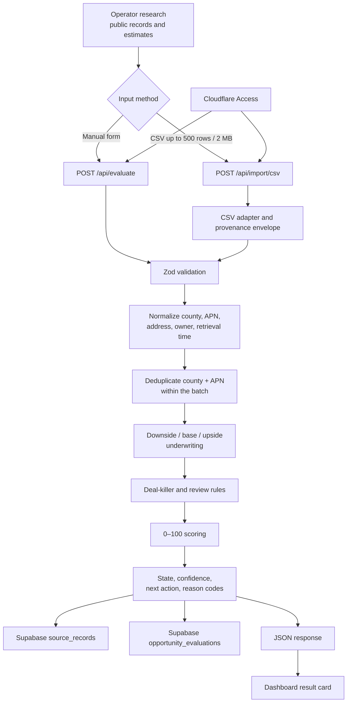

# Phase 1 Session Note — GNS Success Wholesale Engine

**Recorded:** August 22, 2026

**Phase 1 status:** Operational in production

**Production application:** `https://wholesale.gns-success.com`

**Canonical repository:** `https://github.com/gemmaserenity/gns-success-wholesale-engine`

**Operators:** Sascha and Gemma

## 1. Why this system exists

The GNS Success Wholesale Engine is a private acquisition-screening system for residential real-estate wholesale opportunities. Its purpose is not to collect the largest possible lead list. Its purpose is to eliminate weak opportunities quickly and explain which properties may justify more research, enrichment, or human attention.

The central Phase 1 question is:

> Can this Arizona trustee-sale property plausibly produce a wholesale assignment of at least $10,000, and is the supporting evidence strong enough to justify spending more time or money on it?

The operating philosophy is:

```text
free/public data
→ inexpensive deterministic screening
→ ruthless rejection
→ selective research or enrichment
→ human judgment and closing
→ revenue
→ reinvestment in better data and automation
```

The system is deliberately deterministic. Calculations, validation, deduplication, rules, scoring, and state decisions are normal software—not an opaque AI opinion. AI is reserved for later situations where interpretation genuinely adds value.

## 2. What Phase 1 accomplished

Phase 1 produced a working vertical slice that can:

- accept a single opportunity through a browser form;
- accept a CSV batch of as many as 500 records and 2 MB;
- validate required fields and ranges;
- normalize Maricopa and Pinal County records;
- normalize parcel/APN, address, and owner values;
- create a stable county-and-APN deduplication key;
- reject duplicate rows inside one CSV import;
- calculate downside, base, and upside underwriting scenarios;
- apply explicit deal-killer and human-review rules;
- calculate a transparent score from 0 to 100;
- assign an auditable pipeline state and next action;
- return an operator-friendly result with economics, confidence, risks, and reasons;
- preserve the raw input, normalized record, source provenance, and completed evaluation in Supabase;
- operate locally without database credentials for safe stateless evaluation;
- operate privately in production behind Cloudflare Access;
- deploy the Worker and static dashboard together from GitHub;
- provide a branded installable/mobile-friendly web experience with favicons and a web manifest;
- pass 17 automated tests covering ingestion, deduplication, underwriting, scoring, decisioning, state transitions, and Supabase authentication behavior.

This is an evaluation engine, not yet a complete acquisition CRM or an automated lead-generation system.

## 3. Current live production arrangement

The live system uses one Cloudflare Worker:

```text
Worker name: gns-success-wholesale-engine
Custom hostname: wholesale.gns-success.com
Runtime mode: production
Git branch: main
```

There is no separate `gns-success-wholesale-engine-production` Worker. An earlier Wrangler definition would have created that nonexistent suffixed Worker, so it was removed. The base Worker is the production Worker and is the target of the Git deployment, custom hostname, and secrets.

Both the normal `workers.dev` address and Worker preview URLs are disabled in `wrangler.jsonc`. This preserves the intended access path:

```text
wholesale.gns-success.com
→ Cloudflare Access
→ GNS Worker and dashboard
```

Cloudflare Access protects the entire hostname. After an approved operator signs in, Cloudflare supplies the `Cf-Access-Jwt-Assertion` header used by the production API boundary. Operators do not create or paste this header themselves.

## 4. Technology stack and responsibilities

| Layer | Technology | Current responsibility |
| --- | --- | --- |
| Source control | GitHub | Canonical code, documentation, change history, and Git deployment source |
| Edge application | Cloudflare Workers | API execution, validation boundary, deterministic evaluation, and static-asset delivery |
| Private access | Cloudflare Access | Operator authentication in front of the entire production hostname |
| DNS and hostname | Cloudflare | Routes `wholesale.gns-success.com` to the Worker |
| Database | Supabase/PostgreSQL | Canonical persistent source records and opportunity evaluations; schema foundation for later phases |
| Browser interface | HTML, CSS, and vanilla JavaScript | Manual entry, CSV upload, health state, and result presentation |
| Domain code | TypeScript | Normalization, underwriting, deal-killer rules, scoring, and pipeline decisions |
| Validation | Zod | Runtime input validation and readable validation errors |
| Testing | Vitest | Deterministic unit and integration-style behavior tests |
| Local/deployment tooling | Node.js 22+, Wrangler 4 | Local Worker runtime, binding types, build validation, and deployment |
| Branding | GNS Success assets | Favicons, mobile icons, logo lockups, web manifest, desert palette, and detailed Saguaro watermark |
| Later stack | Cloudflare Workflows, Resend, Cal.com | Intentionally deferred to Phase 2 or later |

The UI intentionally avoids a large JavaScript framework. One Worker and Workers Static Assets keep the Phase 1 system inexpensive and understandable.

## 5. How data circulates



### Detailed journey

1. **An operator gathers evidence.** Phase 1 expects operator-assisted public-record research, manual entry, or CSV input. It does not depend on brittle unauthorized county-site scraping.
2. **Cloudflare Access authenticates the operator.** Access protects the whole custom hostname before the application is reached.
3. **The browser calls the Worker.** Manual entries go to `POST /api/evaluate`; CSV files go to `POST /api/import/csv`.
4. **The Worker bounds and validates the request.** Manual JSON is limited to 65,536 bytes. CSV uses the configured 2 MB maximum and is capped at 500 records. Zod validates types, required fields, confidence ranges, URLs, dates, and low/high ordering.
5. **The input is normalized.** County aliases become `MARICOPA` or `PINAL`; punctuation is removed from APNs; address and owner whitespace/case are normalized; and the key `AZ:<COUNTY>:<APN>` is created.
6. **CSV duplicates are detected.** A repeated county/APN in the current batch is rejected with `REJECT_DUPLICATE`.
7. **Three underwriting scenarios are calculated.** The engine evaluates downside, base, and upside combinations rather than trusting one point estimate.
8. **Rules identify rejection or review conditions.** Every decision carries machine-readable reason codes and a human-readable explanation.
9. **The score is calculated.** Economics and evidence are converted into a transparent 0–100 score with component values.
10. **The state and next action are selected.** A result becomes rejected, remains in preliminary screening, or qualifies for further work.
11. **Production results are persisted.** The Worker writes the provenance record and complete evaluation to Supabase using a server-only modern secret key.
12. **The dashboard renders the answer.** The operator sees the score, assignment range, maximum contract, confidence, risks, reasons, and recommended next action.

## 6. How to use the production application

### Open and authenticate

1. Visit `https://wholesale.gns-success.com`.
2. Complete the Cloudflare Access sign-in using an approved operator identity.
3. Confirm that the top-right status reads **Engine online · Supabase connected**.

That status confirms that the Worker received a Supabase URL and a correctly shaped modern secret; it is not a database write probe. A successful evaluation with `persisted: true` is the definitive application-level confirmation. If the header says **local evaluation mode** in production, stop before relying on persistence and check the Worker secrets.

### Evaluate one property manually

1. Stay on **Manual evaluation**.
2. Select Maricopa or Pinal County.
3. Enter the APN, property address, apparent owner, trustee-sale date, and source record ID when available.
4. Enter ranges for ARV, repairs, and debt. Ranges are intentional because these values may still be estimates.
5. Add known liens and a proposed contract price if one exists.
6. Set owner confidence and data confidence honestly.
7. Add provisional buyer-demand and property-desirability scores when supportable.
8. Mark known title complexity or owner mismatch rather than hiding uncertainty.
9. Select **Evaluate opportunity**.
10. Read the reason codes and next action—not only the headline score.

The form contains representative starting values for convenience. They are not verified facts for a new property and must be replaced before an evaluation is treated as meaningful.

### Evaluate a CSV batch

1. Select **CSV batch**.
2. Download the provided template from the application.
3. Preserve the documented column names exactly.
4. Populate no more than 500 rows and keep the file below 2 MB.
5. Upload the file and select **Import and evaluate**.
6. Review the batch summary and the results sorted by score.

The template is stored at `apps/dashboard/public/trustee-sale-template.csv`.

### Interpret a result

Each result card contains:

- the normalized property, county, APN, and owner;
- score and score band;
- base ARV;
- estimated debt plus liens;
- maximum contract price that preserves the target fee;
- downside-to-upside assignment range;
- confidence;
- decision evidence and reason codes;
- trustee-sale timing when supplied;
- the recommended next action.

The result is a screening decision, not a title report, appraisal, legal conclusion, guaranteed assignment fee, or authorization to contact a seller.

## 7. Underwriting model

The defaults are intentionally configurable and are not presented as a universal “70% rule”:

| Parameter | Phase 1 default |
| --- | ---: |
| Investor purchase factor | 0.78 |
| Transaction/risk buffer | $12,000 |
| Minimum seller proceeds above debt/liens | $5,000 |
| Desired assignment fee | $10,000 |

For each scenario:

```text
Investor purchase ceiling
= ARV × investor purchase factor
− repairs
− transaction/risk buffer

Estimated contract price
= proposed contract price, when supplied
  otherwise debt + liens + minimum seller proceeds

Maximum contract for target fee
= investor purchase ceiling − desired assignment fee

Expected assignment fee
= investor purchase ceiling − estimated contract price

Estimated equity
= ARV − debt − liens
```

Scenario inputs are selected as follows:

| Scenario | ARV | Repairs | Debt |
| --- | --- | --- | --- |
| Downside | Low | High | High |
| Base | Midpoint | Midpoint | Midpoint |
| Upside | High | Low | Low |

## 8. Deal-killer and review behavior

Phase 1 uses explicit codes so a rejected record always explains why it stopped.

### Current rejection conditions

- `REJECT_DUPLICATE` — the same normalized county/APN appears again in the CSV batch.
- `REJECT_OWNER_MISMATCH` — the distress-record owner and resolved owner are known not to match.
- `REJECT_OWNER_UNRESOLVED` — owner confidence is below 50%.
- `REJECT_LOW_EQUITY` — estimated debt and liens consume the estimated value.
- `REJECT_NEGATIVE_SPREAD` — the base investor ceiling is below the estimated contract price.
- `REJECT_ASSIGNMENT_BELOW_TARGET` — the base assignment is below $10,000.
- `REJECT_SALE_DATE_PASSED` — the supplied trustee-sale date is already past.
- `REJECT_TIMELINE_TOO_SHORT` — fewer than seven days remain.

### Current human-review conditions

- `REVIEW_DATA_CONFIDENCE` — evidence confidence is below 55%.
- `REVIEW_TITLE_COMPLEXITY` — known complexity requires human verification.

### Positive evidence

- `PASS_ASSIGNMENT_TARGET` — the base scenario meets the $10,000 assignment target and no rejection condition applies.

## 9. Scoring, state, and next action

The score is a weighted 0–100 total:

| Component | Maximum points |
| --- | ---: |
| Projected assignment economics | 25 |
| Equity confidence | 15 |
| Distress signal | 15 |
| Buyer demand | 15 |
| Timeline | 10 |
| Property desirability | 10 |
| Contactability | 5 |
| Data confidence | 5 |

If optional Phase 1 fields are absent, the scoring engine currently uses conservative working defaults: buyer demand 60/100, property desirability 60/100, contactability 20/100, and a reduced timeline factor when no sale date is supplied. These are provisional scoring inputs, not verified facts.

Score bands are:

- 90–100: `IMMEDIATE_PRIORITY`
- 80–89: `HIGH_PRIORITY`
- 70–79: `RESEARCH_NURTURE`
- below 70: `ARCHIVE`

Decision routing then applies this order:

1. Any rejection reason → state `REJECTED`, next action `REJECT`.
2. Otherwise, any review reason → next action `HUMAN_REVIEW`.
3. Otherwise, score 90+ → next action `CONTACT_READY`.
4. Otherwise, score 80+ → next action `ENRICH`.
5. Otherwise → next action `RESEARCH`.

Non-rejected scores of 80+ receive state `QUALIFIED`; lower non-rejected results remain `PRELIM_SCREEN`.

The Phase 1 lifecycle implemented in code is:

```text
DISCOVERED → NORMALIZED → PRELIM_SCREEN → QUALIFIED
                                  └─────→ REJECTED
```

Idempotent same-state retries are allowed. Invalid state skipping is rejected by the state-machine code.

## 10. What Supabase stores today

Supabase/PostgreSQL is the canonical persistent store. The production Worker uses:

```text
SUPABASE_URL
SUPABASE_SECRET_KEY
```

`SUPABASE_SECRET_KEY` must be a modern `sb_secret_…` server key. It is sent only in the `apikey` header from the Worker and is never sent to browser code. The legacy JWT `service_role`, `anon`, publishable key, and JWT signing secret are intentionally not accepted by the repository code.

### Tables actively written by Phase 1

`source_records` receives:

- source and source record ID;
- retrieval timestamp and optional source URL;
- parser version;
- complete raw payload;
- normalized payload;
- data confidence.

The `(source, source_record_id)` uniqueness rule makes repeated provenance writes merge safely.

`opportunity_evaluations` receives:

- evaluation UUID and timestamp;
- normalized county, APN, address, and owner;
- trustee-sale date;
- deduplication key;
- score, state, confidence, and next action;
- base underwriting result;
- the complete evaluation JSON, including all scenarios and reasons.

Each evaluation is immutable in the current application and receives a new UUID.

### Schema foundations not yet populated by the application

The Phase 1 migration also created:

- `properties`
- `owners`
- `ownership_interests`
- `distress_events`
- `pipeline_events`
- `human_overrides`
- `audit_events`

These tables, constraints, indexes, and RLS policies establish a normalized foundation, but the current persistence repository does not yet write to them. Wiring those records and workflows is future work.

### The deployment-time 403 and its resolution

The first production insert reached Supabase but returned `source_records write failed with status 403`. The hostname change did not cause this. The active Worker already had the correct secret names. The practical database correction was to ensure that the server-side `service_role` used by a valid `sb_secret_…` key had explicit access to the two Phase 1 write tables:

```sql
grant usage on schema public to service_role;

grant select, insert, update, delete
on table public.source_records
to service_role;

grant select, insert, update, delete
on table public.opportunity_evaluations
to service_role;
```

If a 403 returns, first confirm that `SUPABASE_URL` and the `sb_secret_…` key belong to the same Supabase project, then confirm these table grants.

The application does not currently use Supabase Auth for operator login. Cloudflare Access handles login, so Supabase Site URL and redirect URL settings do not control the current application.

## 11. Security boundary

Current protections include:

- Cloudflare Access in front of the entire production hostname;
- no public production or preview `workers.dev` URL;
- a production API check for Cloudflare's Access assertion header;
- same-origin enforcement for production mutation requests;
- request-size limits;
- schema validation before calculations or writes;
- output escaping in browser-rendered values;
- server-only Supabase credentials;
- secrets excluded from Git;
- PostgreSQL constraints and row-level security;
- structured Worker error logging and Cloudflare observability.

Access must continue to protect `wholesale.gns-success.com`, not merely `/api`. The static dashboard is delivered as a Worker asset, so protecting the full hostname is what keeps both the interface and API private.

The Phase 1 Worker checks that the Access assertion header is present; Cloudflare Access performs the actual authentication at the hostname boundary. Cryptographic JWT audience validation inside the Worker is a possible defense-in-depth improvement for a later phase.

Production and local development intentionally differ:

- production runs with `ENVIRONMENT=production` and requires the Access boundary;
- `npm run dev` overrides only the local process to `ENVIRONMENT=development` so localhost remains usable.

## 12. Deployment and configuration facts

The project is a **Cloudflare Worker with static assets**, not a separate Cloudflare Pages site.

Important deployment choices:

- Cloudflare Git integration points at the repository root, where `wrangler.jsonc` lives.
- The root path is not `dist` and is not `workers/api`.
- `workers/api/index.ts` is the Worker entry point configured by Wrangler.
- `apps/dashboard/public` is the static asset directory.
- `dist` is ignored build output and is not committed or used as the Git deployment root.
- `/api/*` runs through the Worker first; other requests are served from the asset binding.
- The single production Worker is `gns-success-wholesale-engine`.
- `workers_dev` and `preview_urls` are both false in version-controlled configuration.
- The production custom hostname is `wholesale.gns-success.com`.

Required production Worker secrets are attached to that base Worker:

```text
SUPABASE_URL
SUPABASE_SECRET_KEY
```

To set them interactively without exposing values in shell history:

```bash
npx wrangler secret put SUPABASE_URL
npx wrangler secret put SUPABASE_SECRET_KEY
```

Validate and manually deploy with:

```bash
npm run build
npx wrangler deploy
```

Normal production changes are committed to `main` and pushed to GitHub, after which the configured Cloudflare Git deployment builds the repository.

## 13. Local development and verification

Requirements:

- Node.js 22 or newer;
- repository dependencies installed with `npm install`;
- optional `.dev.vars` copied from `.dev.vars.example`.

Start locally:

```bash
cp .dev.vars.example .dev.vars
npm install
npm run dev
```

Supabase values may remain blank for stateless local evaluation. The local status will say **local evaluation mode**, and no database rows will be written.

Run the full verification set:

```bash
npm run cf-typegen
npm run typecheck
npm test
npm run build
```

At the end of Phase 1, the suite contains 17 passing tests across five test files.

## 14. Repository map

| Path | Purpose |
| --- | --- |
| `workers/api/index.ts` | Worker routing, Access boundary, request limits, API endpoints, persistence orchestration, and static assets |
| `apps/dashboard/public/index.html` | Operator interface structure and manual/CSV forms |
| `apps/dashboard/public/app.js` | Browser API calls and result rendering |
| `apps/dashboard/public/styles.css` | Responsive desert-inspired visual system |
| `apps/dashboard/public/trustee-sale-template.csv` | Import template and representative row |
| `src/adapters/source-adapter.ts` | Replaceable source-adapter contract |
| `src/adapters/csv/csv-adapter.ts` | CSV parsing, validation preparation, and provenance envelope |
| `src/adapters/maricopa/` | Placeholder boundary for a future lawful Maricopa adapter |
| `src/adapters/pinal/` | Placeholder boundary for a future lawful Pinal adapter |
| `src/domain/opportunities/` | Types, validation schema, normalization, and state machine |
| `src/domain/underwriting/` | Scenario calculations and deal-killer rules |
| `src/domain/scoring/engine.ts` | Transparent weighted score |
| `src/services/evaluate-opportunity.ts` | End-to-end deterministic evaluation composition |
| `src/services/supabase-repository.ts` | Server-side provenance and evaluation persistence |
| `supabase/migrations/202608220001_phase1_opportunity_screening.sql` | Versioned PostgreSQL schema, indexes, constraints, RLS, and policies |
| `tests/` | Fixtures and automated behavior tests |
| `wrangler.jsonc` | Single production Worker, assets, observability, limits, and disabled public Worker URLs |
| `worker-configuration.d.ts` | Generated Cloudflare binding and runtime types |
| `docs/` | Architecture, decisions, deployment, data, scoring, underwriting, compliance, and roadmap |

## 15. Branding and operator experience

The original dark-green direction was replaced with a warmer Arizona identity:

- warm stone and gray foundations;
- brown and red-rock text/accent colors;
- vivid natural orange highlights;
- GNS Success logo assets across the header, assignment target, favicon, Apple touch icon, and web manifest;
- a detailed hand-drawn Saguaro used as a restrained background filigree;
- responsive behavior for desktop and mobile.

The application title is **GNS Success — Opportunity Desk**, and its interface principle is “Put the economics first.”

## 16. Important limitations—what Phase 1 does not yet do

Do not assume the following capabilities are live:

- automated county recorder or assessor ingestion;
- automated property resolution beyond operator-supplied values;
- automatic valuations or comparable-sales retrieval;
- automatic mortgage payoff, lien, tax, HOA, bankruptcy, or probate resolution;
- a populated buyer database or measured buyer-demand model;
- selective skip tracing;
- seller outreach or communication automation;
- seller qualification conversations;
- Cal.com appointment gating;
- Resend operator or seller notifications;
- Cloudflare Workflows, queues, schedules, or durable retries;
- a seller-facing portal;
- human override UI and audit-event workflows;
- property/owner/distress-event persistence from the current evaluation path;
- title, legal, appraisal, or compliance conclusions;
- closed-deal outcome tracking and score calibration.

The buyer-demand and property-desirability fields in Phase 1 are operator-supplied provisional scores. They are not yet derived from a buyer database.

## 17. Phase 1 implementation history

Significant commits, in chronological order:

- `d41ca09` — initialized the repository, architecture, documentation, and project structure;
- `17487d5` — implemented the operational Phase 1 application, domain engine, dashboard, migration, and tests;
- `b328286` — placed seed SQL under the migration directory;
- `fa52153` — adopted modern `SUPABASE_SECRET_KEY=sb_secret_…` authentication and tests;
- `cf7a0ba` — integrated branded favicons, application icons, desert styling, and recolored identity assets;
- `42d96c6` — replaced the simple cactus outline with the detailed Saguaro watermark;
- `a70f804` — changed the production hostname to `wholesale.gns-success.com`;
- `e6902f9` — aligned Wrangler with the real single production Worker and disabled public/preview Worker URLs.

Git history is the authoritative record if later behavior and this note ever disagree.

## 18. Troubleshooting quick reference

### “Cloudflare Access authentication required”

- Open `https://wholesale.gns-success.com`, not a Worker URL.
- Confirm the Access application covers the entire hostname.
- Sign in through Cloudflare Access; do not manually add the assertion header.

### No `workers.dev` page is available

This is intentional. Production and preview Worker URLs were disabled so the application is reachable only through the protected custom hostname.

### “Engine online · local evaluation mode” in production

- Confirm both Supabase secrets exist on `gns-success-wholesale-engine`.
- Confirm the secret is a valid modern `sb_secret_…` key.
- Confirm the secret and URL belong to the same Supabase project.

### `Supabase source_records write failed with status 403`

- Confirm the key/URL project match.
- Confirm the explicit `service_role` grants in Section 10.
- Confirm the migration was applied to the intended Supabase project.

### Cloudflare Git build asks for a root path

Use the repository root. Do not use `dist` or `workers/api`.

### Localhost returns an Access error

Start it through `npm run dev`; that command applies the local-only development override.

## 19. Sensible Phase 2 starting point

Phase 2 is **Qualification and Acquisition**. Before adding outreach automation, inspect the live Phase 1 data and preserve its deterministic core. A sensible implementation sequence is:

1. wire normalized properties, owners, ownership interests, and distress events into persistence;
2. add a durable opportunity list/history view instead of showing only the latest response;
3. add improved property enrichment behind explicit cost and confidence gates;
4. introduce the buyer database, buyer criteria, and evidence-based buyer-demand scoring;
5. add selective skip tracing only for economically qualified records;
6. build seller intake and qualification with consent and suppression controls;
7. add operator notifications through Resend;
8. gate Cal.com booking behind qualification rules;
9. use Cloudflare Workflows only where retries, resumability, or multi-step orchestration are actually needed;
10. begin outcome tracking so projected economics and scores can be compared with contracts and closed assignments.

Phase 2 must not weaken the Phase 1 principle: paid enrichment and human attention belong downstream of inexpensive economic screening.

## 20. Five-minute reorientation checklist

If returning to this project after a long absence:

1. Read Sections 1, 2, 3, 5, 6, 10, 16, and 19 of this note.
2. Open `https://wholesale.gns-success.com` and authenticate through Cloudflare Access.
3. Confirm **Supabase connected** appears in the application header.
4. Run one representative manual evaluation and inspect the two Supabase tables that Phase 1 actively writes.
5. Check `git status` and the latest commits on `main`.
6. Run `npm run typecheck`, `npm test`, and `npm run build` before beginning new implementation.
7. Treat GitHub, migrations, and the repository documentation as canonical—not old chat memory.

The enduring summary is:

> Phase 1 is a private, working Arizona trustee-sale screening engine. It accepts operator evidence, applies transparent economics and rejection logic, records the result, and tells Sascha and Gemma which opportunities deserve the next dollar or hour.
